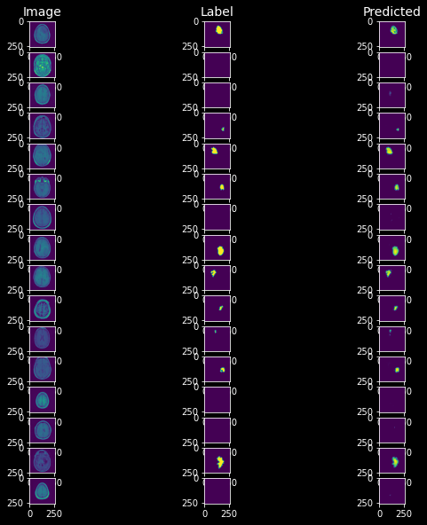

# **Tumor Detector 2.0**
---
## **About**
Tumor Detector 2.0 aims to help the health professionals to spot and localize with a semantic segmentation tumors in tomography images. The main part of this project consist in a neural network (NN) based on U-Net architecture which has the capability to segment image features to localize and show-up the main content extracted from image, which is most of the time used to classify what class the image belongs to.

- ### **Performance**
Some of the inference results of **U-Net** is showed below. We've tested it's ability to classify if an image has either a tumor or not. It is based if exists any semantic segmentation in the output of NN.
- **Description:**
  - 0: No Tumor.
  - 1: Tumor.
  - Precision: Percetage of hits cosidering all correct preditions divided by all predicted values.
  - Recall: Percentage of hits considering all correct preditions divided by all data of that particular class.
  - Accuracy: Overall precision. Number of hits divided by number of elements.


Some of the segmentation predictions is showed below. Here we passed a **batch-size of 16** to run the inference.



We've used **Binary IoU** to estimate the accuracy of over-lapping between the 
predicted mask and the real mask. Here is the results:
- **Binary IoU Results:**
  - Number of elements: 364
  - Mean: 0.816804 (81.68%)
  - Standard Deviation: 0.010044
  - Min: 0.808381 (80.83%)
  - Q1: 0.811199 (81.12%)
  - Q2: 0.812790 (81.28%) - *Most of the prediction correspond to this accuracy.*
  - Q3: 0.817353 (81.73%)
  - Max: 0.866287 (86.63%)
## **Requirements**
  - Python 3.10
  - Tensorflow 2.10
  - Scikit-Learn 1.1.3
  - TKinter
  - Git
  - OS:
    - Windows 10
    - Ubuntu 22.04
---
## **Install**
First, clone the **Tumor Detector 2.0** repository to your computer using the command line below on terminal (prompt).
```
git clone https://github.com/brain-facens/Tumor-Detector-2.0
```
### **Virtual Environment (not mandatory)**
*It is recommended to use a separeted environment of your computer to install the project. It avoids the project packages to conflict with external packages of your computer.*
To do it, make sure you have either [Anaconda](https://www.anaconda.com) installed in your computer or [Env](https://docs.python.org/3/tutorial/venv.html) from Python to create a virtual environment.
  - ### Anaconda (recommended)
  To create an environment using Anaconda, use the command below on terminal.
  ```
  conda create --name tumor python=3.10.6
  ```
  It will create a virtual environment called 'tumor' with Python 3.10.6 installed. To activated it, use the command below on terminal.
  ```
  conda activate tumor
  ```

  - ### Python Env
  To create an environment using Python Env, use the command below on terminal.
  ```
  python3 -m venv tumor --python="path/to/python3.9" "path/to/tumor"
  ```
  *In this case, you'll need to specify the path of Python 3.9 in your computer and the path of the virtual environment that you're creating using the command '--python' to specify the Python version of your virtual environment.*

  To activated it, use the command below on terminal.
  ```
  (Windows): tumor\Scripts\activate
  (Linux): source tumor/bin/activate
  ```
To install the project, run the command below on your terminal.
```
cd Tumor-Detector-2.0/ # to go inside of project folder
pip install .
```
## **Run**
To run the application, run the command below on terminal.
- #### With GPU
```
python run.py
# or
python3 run.py
```
- #### Without GPU (on CPU)
```
python run.py --device cpu
# or
python3 run.py --device cpu
```
---